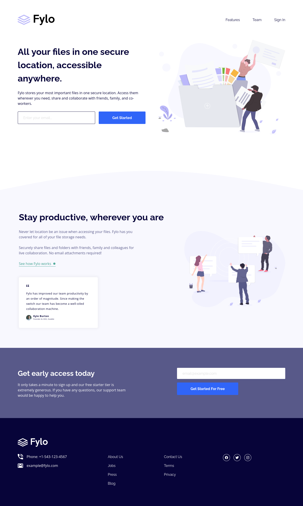

# Frontend Mentor - Clipboard landing page

## Overview

### Screenshot

#### Desktop

### Links

- Solution URL: [https://www.frontendmentor.io/solutions/clipboard-landing-page-using-sass-i3qt6F8GI9](https://www.frontendmentor.io/solutions/clipboard-landing-page-using-sass-i3qt6F8GI9)
- Live Site URL: [https://codermoshiur.github.io/clipboard-landing-page/](https://codermoshiur.github.io/clipboard-landing-page/)

## My process

### Built with

- Semantic HTML5 markup
- Sass
- CSS Grid

## Author

- Website - [Moshiur](https://codersfoundation.com)
- Youtube - [@moshiur](https://www.youtube.com/moshiur)
- Facebook - [@codermoshiur](https://www.facebook.com/codermoshiur)
- Frontend Mentor - [@codermoshiur](https://www.frontendmentor.io/profile/codermoshiur)
